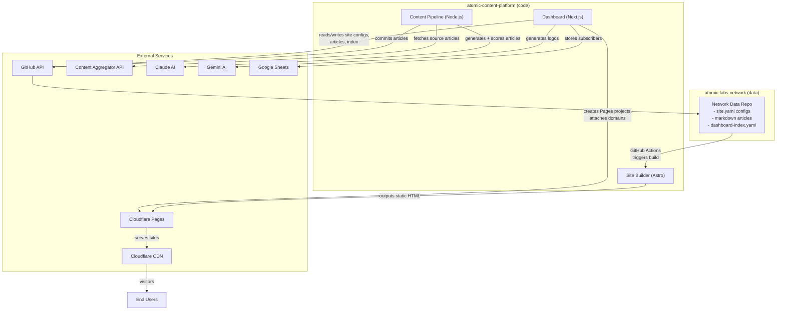

# System Architecture Overview

The Atomic Content Network Platform manages a fleet of ad-monetized static websites. Content is generated by AI, reviewed by humans, built into static sites, and served via Cloudflare.

## Two-Repo Architecture

| Repo | Contains | Who writes to it |
|------|----------|-----------------|
| `atomic-content-platform` | All code: dashboard, site builder, content pipeline, shared types | Developers |
| `atomic-labs-network` | Pure data: YAML configs, markdown articles, site assets | Dashboard + Content Pipeline (via GitHub API) |

The code repo never touches article content. The data repo never contains code. This separation means the content pipeline and dashboard operate entirely through Git commits to the data repo.

## System Diagram



## How It Fits Together

1. **Dashboard** -- Operators create sites through a wizard UI. The dashboard writes `site.yaml` configs and a `dashboard-index.yaml` tracker to the data repo via GitHub API. It also creates Cloudflare Pages projects and manages domains.

2. **Content Pipeline** -- An autonomous agent service. It queries the Content Aggregator for source material, uses Claude to rewrite original articles, scores quality, and commits markdown files to the data repo. A cron job (`scheduled-publisher`) runs every 4 hours to keep sites fed with content.

3. **Site Builder** -- An Astro static site generator. GitHub Actions triggers it when the data repo changes. It reads the site's YAML config and markdown articles, resolves the config hierarchy (org -> group -> site), injects shared pages (about, privacy, etc.), generates `ads.txt`, and outputs a static site.

4. **Cloudflare** -- Hosts the built sites via Pages. Each site gets a `*.pages.dev` subdomain immediately, and a custom domain can be attached later. Cloudflare CDN serves everything at the edge.

## Config Hierarchy

Configuration merges three layers using deep merge:

```
org.yaml          -- network-wide defaults (tracking, scripts, legal, ads)
  group.yaml      -- group overrides (e.g., "premium-ads" group)
    site.yaml     -- per-site overrides (domain, brief, theme)
```

The result is a `ResolvedConfig` with every field guaranteed present.

## Key Services in CloudGrid

| Service | Type | Purpose |
|---------|------|---------|
| `dashboard` | Next.js | Management UI, subscribe API, site CRUD |
| `content-pipeline` | Node.js | AI content generation, quality scoring |
| `scheduled-publisher` | Cron | Triggers content generation every 4 hours |

## Tech Stack

- **Monorepo:** Turborepo + pnpm
- **Site Builder:** Astro 6 (static output)
- **Dashboard:** Next.js 15 (App Router, Server Actions)
- **AI:** Claude (article writing + quality scoring), Gemini (logos + topic suggestions)
- **Hosting:** Cloudflare Pages + CDN
- **Deployment:** CloudGrid
- **Data Storage:** GitHub (configs + articles), Google Sheets (subscribers)
